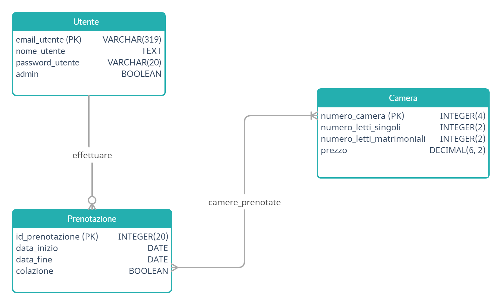

Consegna: realizzare un sistema informatico per la gestione di una piccola attività B&B che permetta:
- ai clienti, di visualizzare le proprie prenotazioni e cancellarle
- ai gestori, di visualizzare tutte le prenotazioni, aggiungerne e rimuoverne (se da essi effettuate)

# Analisi:

Allo scopo di creare un sistema informatico che gestisca le prenotazioni di un'attività B&B, si è progettato un database dove vengono individuate le seguenti entità:

- utente: rappresenta una qualsiasi persona che interagisce con il sistema, differenziando fra clienti e amministratori.
	all'interno dell'entità utente si individuani i seguenti attributi:
 	- nome_utente, di tipo TEXT, rappresenta il nome che l'utente ha scelto per identificare sè stesso
	- email_utente, di tipo VARCHAR e dimensione 319 (massima lunghezza di un indirizzo email), rappresenta l'indirizzo email dell'utente ed essendo quest'ultimo univoco,
	il campo è utilizzato come chiave primaria dell'entità
	- password_utente, di tipo VARCHAR e dimensione 20 (considerata, per semplicità, come massima lunghezza della password),
	rappresenta la password che un utente associa alla email nel momento di registrazione, utilizzata per le operazioni di autenticazione presso il sistema (login)
	- admin, di tipo BOOLEAN, indica se l'utente possiede o meno i diritti di amministratore

- camera: rappresenta virtualmente una camera reale del B&B, si compone dei seguenti attributi:
	- numero_camera, di tipo INTEGER e dimensione 4 (le camere di una piccola attività B&B non dovrebbero superare le 9999 quindi 4 cifre sono sufficienti),
	rappresenta il numero della camera, univoco e pertanto utilizzato come chiave primaria dell'entità
	- numero_letti_singoli, di tipo INTEGER e dimensione 2 (i letti in una camera non dovrebbero superare i 99 quindi 2 cifre sono sufficienti),
	rappresenta il numeo di letti singoli presenti nella camera
	- numero_letti_matrimoniali, di tipo INTEGER e dimensione 2 (i letti in una camera non dovrebbero superare i 99 quindi 2 cifre sono sufficienti),
	rappresenta il numeo di letti matrimoniali presenti nella camera
	- prezzo, di tipo DECIMAL e dimensione (6, 2) (un prezzo di 6 cifre per una camera si dovrebbe adeguare anche ai B&B più costosi, mentre 2 cifre dopo la virgola consentono 
	un adeguato livello di approssimazione), rappresenta il costo che il cliente sostiene per soggiornare una notte nella camera

- prenotazione: rappresenta la prenotazione che un utente effettua in un determinato periodo, coinvolgendo una o più camere. Al suo interno si individuano gli attributi:
	- id_prenotazione, di tipo INTEGER e dimensione 20 (anche nel caso di numerose prenotazioni 20 cifre dovrebbero bastare alla gestione), costituisce un
	identificatore univoco per la prenotazione ed è pertanto utilizzato come chiave primaria dell'entità
	- data_inizio, di tipo DATE, indica la data dalla quale le camere coinvolte nella prenotazione sono riservate all'utente
	- data_fine, di tipo DATE, indica la data fino alla quale le camere coinvolte nella prenotazione sono riservate all'utente
	- colazione, di tipo BOOLEAN, indica se il cliente richiede o meno il servizio di colazione oltre a quello di pernottamento

Tra le entità riportate vengono inoltre individuate le seguenti relazioni:
- effettuare, collega le entità utente e prenotazione, presenta una cardinalità 1 a N in quanto un utente può effettuare più prenotazioni
ed una prenotazione è effettuata da un solo utente
- camere_prenotate, collega le entità camera e prenotazione, presenta una cardinalità N a N in quanto una prenotazione può coinvolgere più camere
e una camera può essere inclusa (in periodi diversi) in più prenotazioni

# Modello relazionale

Dalle considerazioni sopra riportate viene ricavato il seguente modello concettuale, o diagramma E/R:



# Modello logico

Dal modello E/R si ricava il seguente modello logico:

```
utenti(email_utente, nome_utente, password_utente, admin);
camere(numero_camera, numero_letti_singoli, numero_letti_matrimoniali, prezzo);
prenotazioni(id_prenotazione, data_inizio, data_fine, colazione, email_utente);
camere_prenotate(id_prenotazione, numero_camera);
```

# Implementazione

Di seguito sono riportate le istruzioni in linguaggio SQL per creare il database e le tabelle necessarie a implementare il modello logico appena descritto 

```sql
DROP DATABASE IF EXISTS bed_and_breakfast_5ci;
CREATE DATABASE bed_and_breakfast_5ci;

CREATE TABLE utenti(
	nome_utente TEXT NOT NULL,
	email_utente VARCHAR(320) NOT NULL,
	password_utente VARCHAR(20) NOT NULL,
	admin BOOLEAN NOT NULL,
	PRIMARY KEY(email_utente)
);

CREATE TABLE camere(
	numero_camera INTEGER(4) NOT NULL,
	numero_letti_singoli INTEGER(2) NOT NULL,
	numero_letti_matrimoniali INTEGER(2) NOT NULL,
	prezzo DECIMAL(6, 2) NOT NULL,
	PRIMARY KEY(numero_camera)
);

CREATE TABLE prenotazioni(
	id_prenotazione INTEGER(20) AUTO_INCREMENT,
	data_inizio DATE NOT NULL,
	data_fine DATE NOT NULL,
	colazione BOOLEAN NOT NULL,
	email_utente VARCHAR(319) NOT NULL,
	PRIMARY KEY(id_prenotazione),
	FOREIGN KEY(email_utente) REFERENCES utenti(email_utente)
);

CREATE TABLE camere_prenotate(
	id_prenotazione INTEGER(20) NOT NULL,
	numero_camera INTEGER(4) NOT NULL,
	PRIMARY KEY(id_prenotazione, numero_camera),
	FOREIGN KEY(id_prenotazione) REFERENCES prenotazioni(id_prenotazione),
	FOREIGN KEY(numero_camera) REFERENCES camere(numero_camera)
);
```